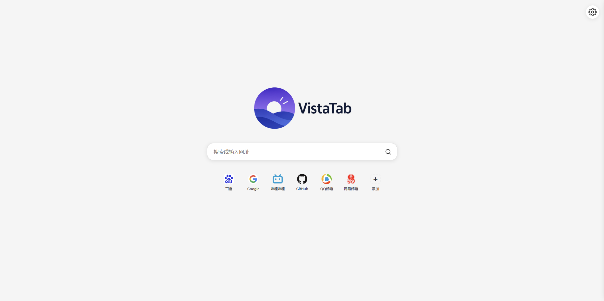
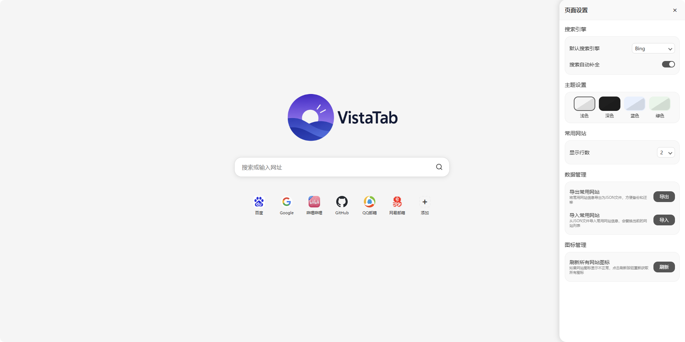

# VistaTab

一个简洁的 Chrome/Edge 浏览器新标签页扩展，提供搜索、快捷网站管理、天气显示和主题切换功能。

[](https://github.com/abcdream-Lary/VistaTab/releases)
[](https://github.com/abcdream-Lary/VistaTab/blob/main/LICENSE)

## 预览

<div align="left">
  
  <br/><br/>
  
</div>

## 功能特性

### 搜索功能
- 多搜索引擎支持（百度、Google、Bing 等）
- 智能 URL 识别，直接输入网址访问
- 搜索词提示，联想搜索
- 搜索防抖优化，性能更佳

### 快捷网站管理
- 增删改网站
- 拖拽排序
- 自动获取网站图标
- 右键编辑网站信息
- 导入导出数据（JSON 格式）
- 图标刷新功能

### 天气小组件
- 实时天气显示
- 点击跳转到天气详情页
- 优雅的天气图标展示

### 主题系统
- 8 种主题可选：浅色、深色、蓝色、绿色、紫色、橙色、粉色
- **跟随浏览器/系统主题**：自动检测并应用浏览器或系统的主题颜色
- 实时主题切换
- 针对 Edge 浏览器的特殊优化

### 响应式设计
- 自适应不同屏幕尺寸
- 快捷网站自动换行
- 流畅的缩放体验

### 设置面板
- 分标签页设计，界面更简洁
- 主题设置
- 天气设置
- 网站设置
- 数据管理（导入/导出/清除）
- 存储容量监控

## 安装方法

### Microsoft Edge
[从 Microsoft Edge 商店安装](https://microsoftedge.microsoft.com/addons/detail/oldkkpidfnnclmpigkdkaaechkedfdch)

### 其他浏览器（Chrome 等）
1. 从 [GitHub Releases](https://github.com/abcdream-Lary/VistaTab/releases) 下载 zip 文件
2. 开启浏览器扩展页面的开发者模式
   - Chrome: `chrome://extensions/`
   - Edge: `edge://extensions/`
3. 将 zip 文件拖入浏览器窗口
4. 完成

## 使用技巧

- **快捷键**: 按 `Ctrl+K` 直接聚焦到搜索框
- **网址输入**: 可直接在搜索框粘贴网址访问
- **图标缓存**: 网站图标会自动缓存（7天有效期），打开新标签页更快
- **右键编辑**: 右键点击网站卡片可以编辑网站信息
- **自定义顺序**: 拖拽网站卡片可以自定义排序
- **跟随主题**: 在设置中开启"跟随浏览器主题"，自动适应系统/浏览器主题

## 项目结构

```
VistaTab/
├── manifest.json           # 扩展配置
├── newtab.html             # 主页面
├── css/
│   └── newtab.css          # 样式
├── js/
│   ├── main.js             # 入口
│   └── modules/            # 功能模块
│       ├── config.js       # 配置
│       ├── utils.js        # 工具
│       ├── storage.js      # 存储
│       ├── search.js       # 搜索
│       ├── quickAccess.js  # 快捷站点
│       ├── settings.js     # 设置
│       ├── weather.js      # 天气
│       └── modals.js       # 弹窗
├── icons/                  # 图标资源
└── Preview/                # 预览图片
```

## 开发

1. 克隆仓库到本地
2. 按照安装方法加载扩展程序
3. 修改代码后刷新扩展程序查看效果

## 更新日志

查看 [CHANGELOG.md](CHANGELOG.md) 了解版本更新历史

## 许可证

MIT License - 查看 [LICENSE](LICENSE) 文件

## 联系方式

- GitHub: [https://github.com/abcdream-Lary/VistaTab](https://github.com/abcdream-Lary/VistaTab)
- 提交 [Issue](https://github.com/abcdream-Lary/VistaTab/issues)
- 邮箱：3447139606@qq.com
