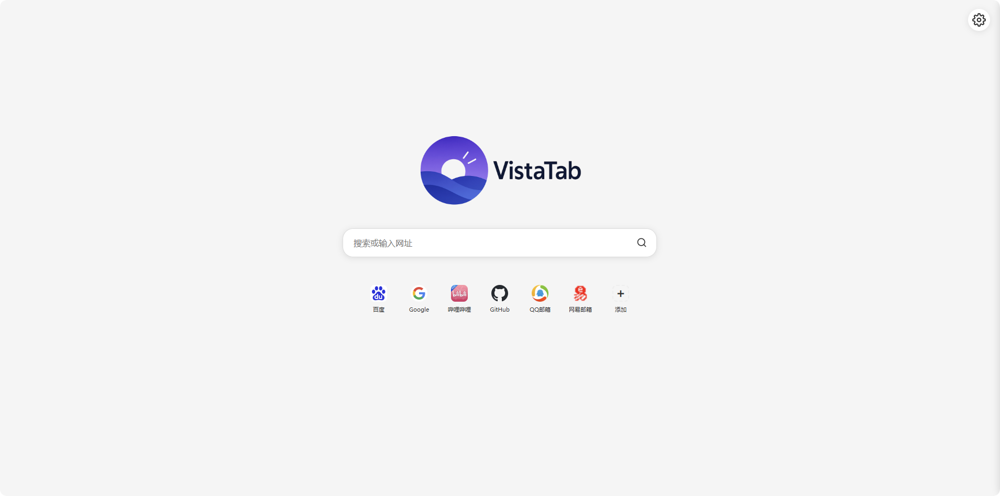

# VistaTab

一个简洁的Chrome浏览器新标签页扩展，提供搜索、快捷网站管理和主题切换功能。

[](https://github.com/abcdream-Lary/VistaTab/releases)
[](https://github.com/abcdream-Lary/VistaTab/blob/main/LICENSE)

## 预览

<div align="left">
  
  <br/><br/>
  
</div>

## 功能特性

### 搜索功能
- 多搜索引擎支持
- 智能URL识别
- 直接输入网址访问

### 快捷网站管理
- 增删改网站
- 拖拽排序
- 自动获取图标
- 右键编辑
- 导入导出数据

### 图标管理
- 智能图标缓存（7天有效期）
- 高质量图标优先（favicon.im服务）
- 多种图标格式支持
- 网络故障时显示首字母图标
- 一键刷新所有图标

### 主题切换
- 浅色/深色/蓝色/绿色
- 实时切换

### 设置选项
- 自定义搜索引擎
- 调整网站显示行数
- 图标刷新

## 安装方法

1. 从GitHub下载zip文件
2. 开启浏览器扩展页面的开发者模式
   - Chrome: `chrome://extensions/`
   - Edge: `edge://extensions/`
3. 将zip文件拖入浏览器窗口
4. 完成

## 使用技巧

- **快捷键**: 按 `Ctrl+K` 直接聚焦到搜索框
- **网址输入**: 可直接在搜索框粘贴网址访问
- **图标缓存**: 网站图标会自动缓存，打开新标签页更快
- **右键编辑**: 右键点击网站卡片可以编辑网站信息
- **自定义顺序**: 拖拽网站卡片可以自定义排序

## 项目结构

```
VistaTab/
├── manifest.json           # 扩展配置
├── newtab.html             # 主页面
├── css/
│   └── newtab.css          # 样式
├── js/
│   ├── main.js             # 入口
│   └── modules/            # 功能模块
│       ├── config.js       # 配置
│       ├── utils.js        # 工具
│       ├── storage.js      # 存储
│       ├── search.js       # 搜索
│       ├── quickAccess.js  # 快捷站点
│       ├── settings.js     # 设置
│       └── modals.js       # 弹窗
└── icons/                  # 图标资源
```

## 开发
1. 克隆仓库到本地
2. 按照安装方法加载扩展程序
3. 修改代码后刷新扩展程序查看效果

## 许可证
MIT License - 查看 [LICENSE](LICENSE) 文件

## 联系方式
- 提交 [Issue](https://github.com/abcdream-Lary/VistaTab/issues)
- 邮箱：3447139606@qq.com